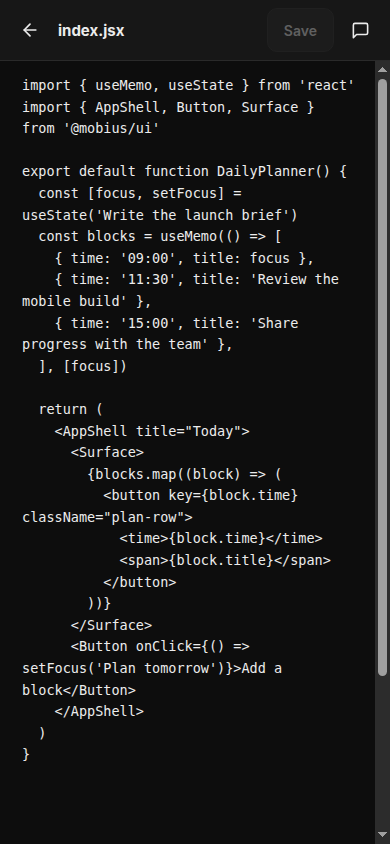
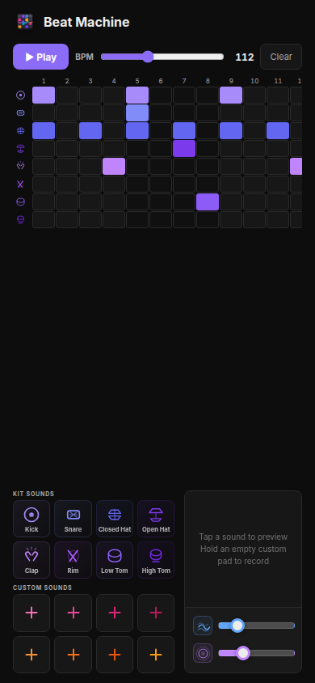
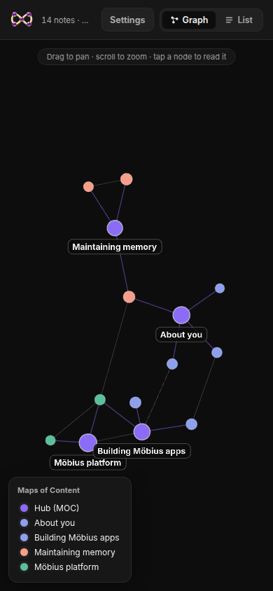

<p align="center">
  
</p>

# Build and launch Möbius

This repository contains the [Möbius OS product site](https://mobius-os.github.io/) and [Möbius Launch](https://mobius.you/), the service that creates private Möbius instances in user-owned Railway accounts. It also publishes the app catalog, manifest specification, and contributor documentation.

<p align="center">
  <a href="https://mobius.you/"><strong>Launch Möbius</strong></a> ·
  <a href="https://mobius-os.github.io/apps/">Browse apps</a> ·
  <a href="https://mobius-os.github.io/docs/contributing.html">Build an app</a> ·
  <a href="https://github.com/mobius-os/mobius">Platform source</a>
</p>


## Build the apps that fit your life

Möbius is an open-source, self-hosted artificial intelligence (AI) workspace for building and using focused apps. You can work beside an agent and inspect the interface and source. The resulting app stays in the same workspace where you use it.

Apps are the main surface. They turn a recurring need into an interface you can open and use. Personalization shares useful context, preferences, files, and themes across the workspace. Reflection reviews completed work and can turn repeated friction into a better default, a skill, or a change to an app.

Möbius saves context and working patterns so the next task starts with more of what it needs.

## Continue from phone or web

Editor keeps the files behind your apps close at hand. Browse the project and change its source on a computer. Open the same code on your phone without setting up another development environment.

<table>
  <tr>
    <td width="68%"></td>
    <td width="32%"></td>
  </tr>
  <tr>
    <td><strong>Desktop:</strong> browse files, inspect repository state, and edit the source.</td>
    <td><strong>Phone:</strong> check the same code and make a small change wherever you are.</td>
  </tr>
</table>

## Use apps with a clear purpose

Community apps cover work, learning, planning, and reflection. Install one as it is, inspect its repository, or change it for your own workflow.

<table>
  <tr>
    <td width="58%"></td>
    <td width="42%"></td>
  </tr>
  <tr>
    <td><strong>Tandem:</strong> read generated material in two languages at your chosen level.</td>
    <td><strong>Beat Machine:</strong> sketch a beat, shape the sound, and add your own recordings.</td>
  </tr>
</table>

The current catalog includes tools for notes, tasks, memory, news, skills, reflection, development, and more.


## Make the workspace yours

Themes control how the workspace looks. Memory connects useful notes, decisions, preferences, and projects so other apps and agents can draw on them. Reflection can flag a pattern that keeps costing time.

<table>
  <tr>
    <td width="36%"></td>
    <td width="64%"></td>
  </tr>
  <tr>
    <td><strong>Memory:</strong> see how the context you keep is connected.</td>
    <td><strong>Themes:</strong> make the whole workspace feel like your own.</td>
  </tr>
</table>

## Improve the platform through use

The roadmap describes a community development loop based on work inside real apps:

1. Build an app for a problem in your own workflow
2. Identify a capability that other apps could reuse
3. Propose the extension for community review and testing
4. Merge the useful primitive into the platform
5. Build better apps with less duplicated work

People can participate at different levels. Some will build an app for themselves. Others will review platform code or help test a change before it ships. Personal extensions can stay private, while reusable work can go back to the community.

## Launch a private workspace

[Möbius Launch](https://mobius.you/) provisions infrastructure without proxying the personal workspace:

1. Sign in to Möbius Launch
2. Connect a Railway workspace you own
3. Review and create the deployment
4. Open, inspect, update, or remove the instance from the launcher

Conversations, files, apps, databases, and agent activity stay inside the deployed Möbius instance. The launcher stores only the account and infrastructure data needed to provision and manage that instance. See the [data transparency page](https://mobius.you/transparency) for the current field-level description.

## Repository map

- `index.html` and `style.css`: product landing page
- `assets/product/`: product screenshots used by the site and README
- `apps/`: generated catalog and app detail pages
- `spec/` and `docs/`: manifest reference and contributor documentation
- `build/`: catalog generation scripts and templates
- `services/mobius_launch/`: Flask service for sign-in, Railway connection, provisioning, and deployment management
- `services/deploy/`: Caddy and Docker Compose production stack

## Update the product site

Edit the landing page and documentation directly. The `.github/workflows/build-site.yml` workflow regenerates `apps/index.html` and each `apps/<id>.html` page from the curated repositories' `mobius.json` manifests. It runs nightly and after pushes to `main`.

To preview a catalog change:

1. Add the app repository slug to `CURATED_REPOS` in `build/build_apps.py`
2. Run `python build/build_apps.py`
3. Open `apps/index.html` in a local server

An app repository can request an immediate refresh by dispatching the `manifest-changed` event. The workflow needs a fine-grained `SITE_DISPATCH_TOKEN` with `contents: write` access to this repository.

```yaml
on:
  push:
    branches: [main]
    paths: [mobius.json]

jobs:
  refresh-site:
    runs-on: ubuntu-latest
    steps:
      - run: |
          curl -fsS -X POST \
            -H "Authorization: Bearer ${{ secrets.SITE_DISPATCH_TOKEN }}" \
            -H "Accept: application/vnd.github+json" \
            https://api.github.com/repos/mobius-os/mobius-os.github.io/dispatches \
            -d '{"event_type":"manifest-changed"}'
```

The nightly workflow remains the default path when an app repository does not dispatch the event.

## Build a Möbius app

Read [Build a Möbius app](docs/contributing.html) for the manifest schema, storage application programming interface (API), theme tokens, sandbox constraints, and navigation protocol. A Möbius app is an ordinary public repository with a `mobius.json` manifest, so people and agents can inspect the same contract.

For launch-service deployment and operations, read [Deploy Möbius Launch](services/deploy/README.md).
