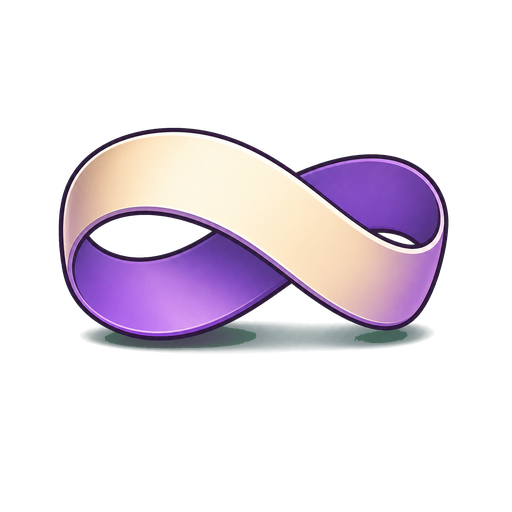
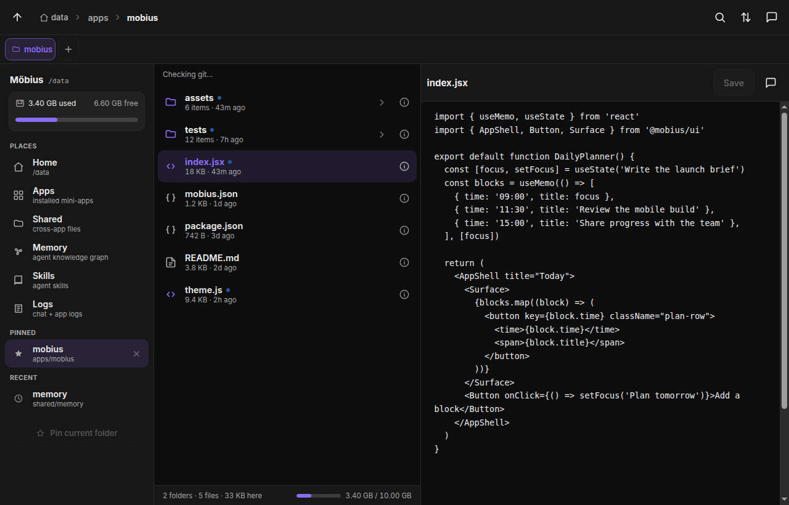
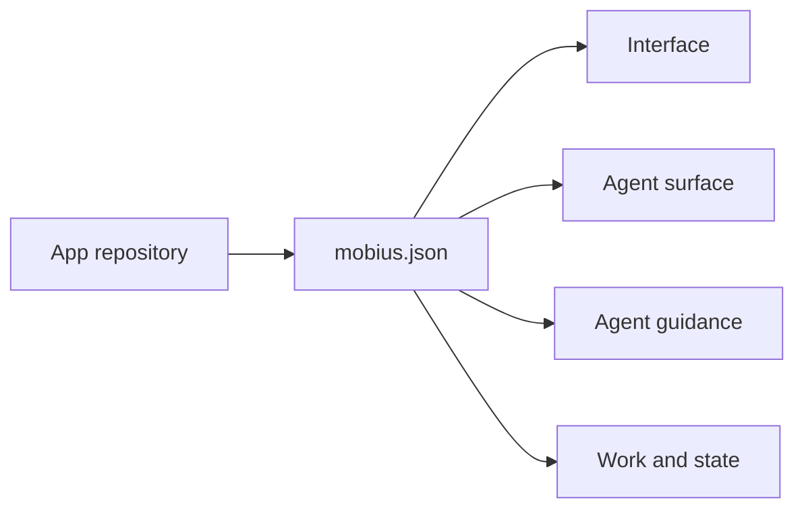
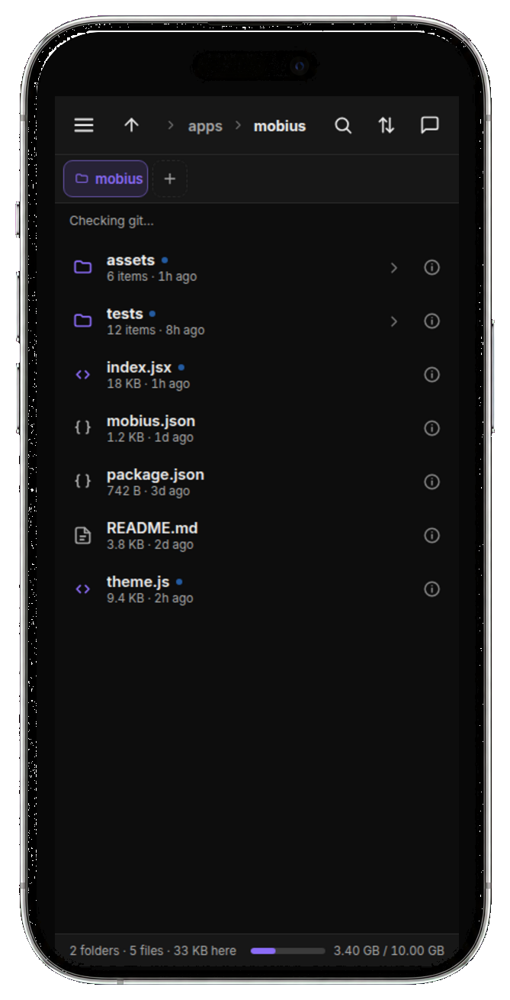
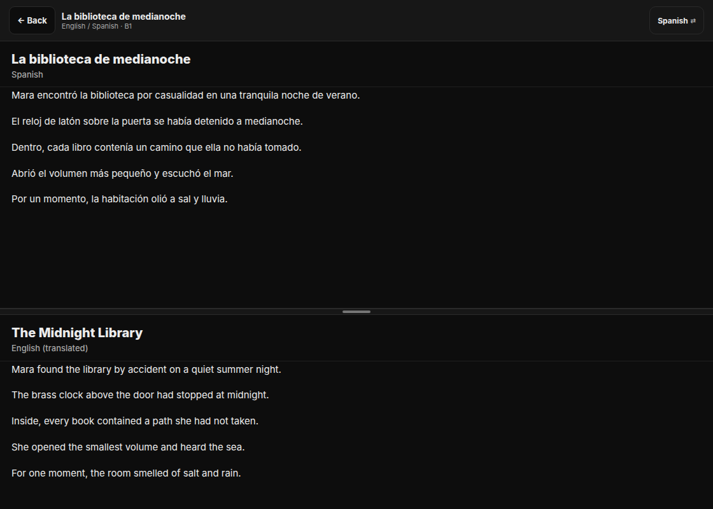
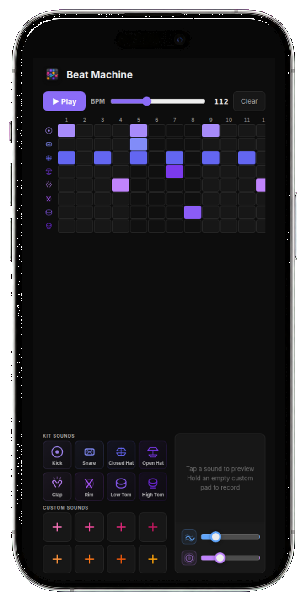
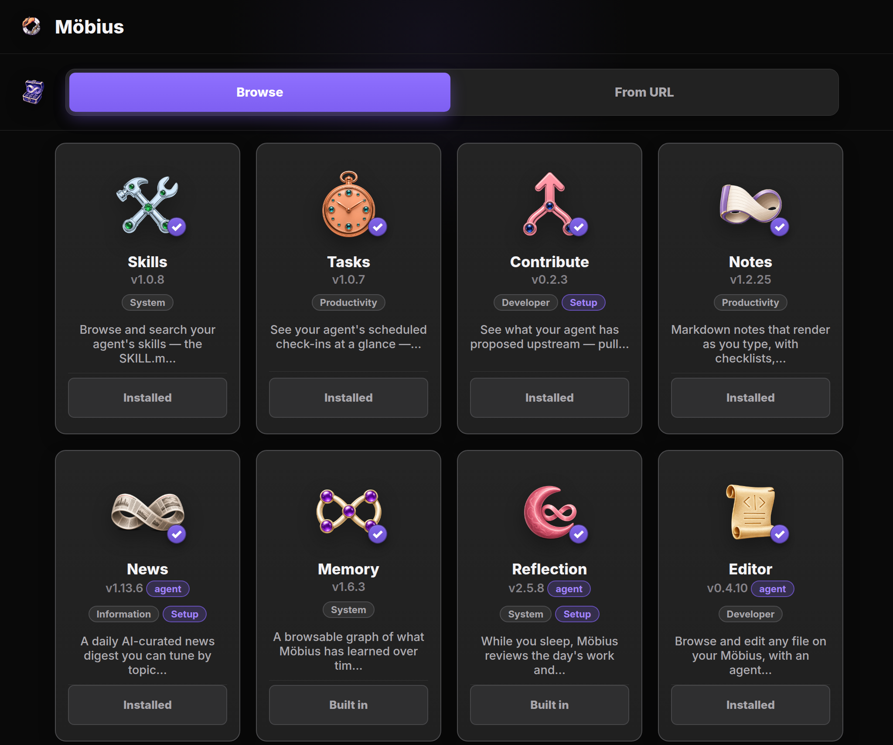
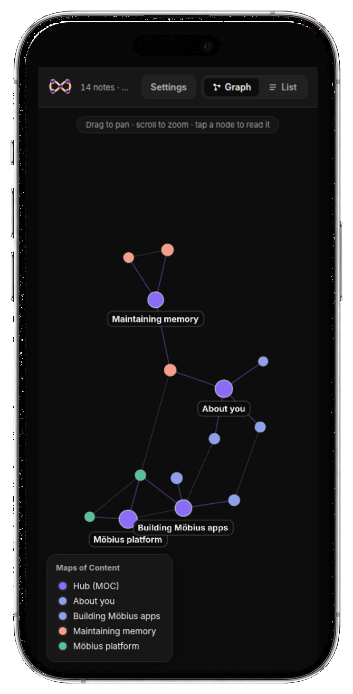
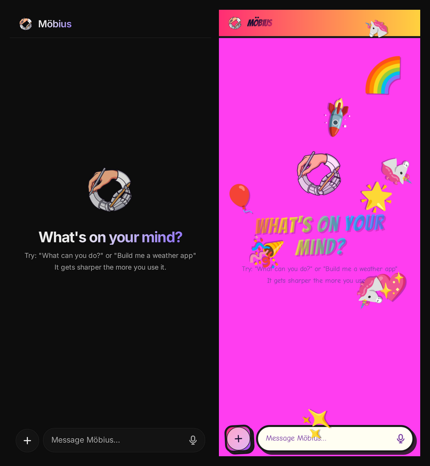

<p align="center">
  
</p>

# Möbius product site and launcher

This repository contains the [Möbius product site](https://mobius-os.github.io/) and [Möbius Launch](https://mobius.you/). It also publishes the app catalog and documentation for people building Möbius apps.

<p align="center">
  <a href="https://mobius.you/"><strong>Launch Möbius</strong></a> ·
  <a href="https://mobius-os.github.io/apps/">Browse apps</a> ·
  <a href="https://mobius-os.github.io/docs/contributing.html">Build an app</a> ·
  <a href="https://github.com/mobius-os/mobius">Platform source</a>
</p>



## Build the apps that fit your life

Möbius is a community-built AGI app platform. A capable coding agent can build an app beside the conversation, then leave it in the same workspace where you use it.

Apps are the main surface. Personalization carries useful context, preferences, files, and themes across the workspace. Memory and Reflection help turn repeated friction into a better default, a skill, or an app change.

Möbius saves context and working patterns so the next task starts with more of what it needs.

## Build more than a screen

A Möbius app can package its interface, agent interaction, guidance, state, and jobs in one inspectable repository. The manifest shows these capabilities and permissions before installation.



Every app declares an interface. The other layers are optional:

- **Interface**: React user interface for representation and direct control
- **Agent surface**: app-owned conversations with context about the app, its source, and its state
- **Agent guidance**: reusable skills and app-scoped instructions; system apps may also extend the shared agent instructions
- **Work and state**: per-app storage plus jobs that run on demand or on a schedule

Current apps combine these layers in different ways:

- **Web Studio**: an editor and live preview with an embedded agent and on-demand build job
- **News**: a digest reader with an embedded agent, editorial settings, and scheduled generation
- **Memory**: a graph interface with a reusable skill, system-level instructions, and background indexing

## Continue from phone or web

Editor keeps the files behind your apps close at hand. Browse the project and change its source on a computer. Open the same code on your phone without setting up another development environment.

<table>
  <tr>
    <td width="68%"></td>
    <td width="32%"></td>
  </tr>
  <tr>
    <td><strong>Desktop:</strong> browse files, inspect repository state, and edit the source.</td>
    <td><strong>Phone:</strong> browse the same project and follow a change wherever you are.</td>
  </tr>
</table>

## Use apps with a clear purpose

Community apps cover work, learning, planning, and reflection. Install one as it is, inspect its repository, or change it for your own workflow.

<table>
  <tr>
    <td width="58%"></td>
    <td width="42%"></td>
  </tr>
  <tr>
    <td><strong>Tandem:</strong> read generated material in two languages at your chosen level.</td>
    <td><strong>Beat Machine:</strong> sketch a beat, shape the sound, and add your own recordings.</td>
  </tr>
</table>

The current catalog includes tools for notes, tasks, memory, news, skills, reflection, development, and more.



## Make the workspace yours

Themes control how the workspace looks. Memory connects useful notes, decisions, preferences, and projects so other apps and agents can draw on them. Reflection can flag a pattern that keeps costing time.

<table>
  <tr>
    <td width="36%"></td>
    <td width="64%"></td>
  </tr>
  <tr>
    <td><strong>Memory:</strong> see how the context you keep is connected.</td>
    <td><strong>Themes:</strong> make the whole workspace feel like your own.</td>
  </tr>
</table>

## Improve the platform through use

The platform grows through work inside real apps:

1. Build an app for a problem in your own workflow
2. Notice a pattern that other apps could reuse
3. Review and test the change with the community
4. Carry the useful part into the platform

Personal changes can stay private. Reusable work can go back to the community as an app, skill, or platform capability.

## Launch a private workspace

[Möbius Launch](https://mobius.you/) provisions infrastructure without proxying the personal workspace:

1. Sign in to Möbius Launch
2. Connect a Railway workspace you own
3. Review and create the deployment
4. Open, inspect, update, or remove the instance from the launcher

Conversations, files, apps, databases, and agent activity stay inside the deployed Möbius instance. The launcher stores only the account and infrastructure data needed to provision and manage that instance. See the [data transparency page](https://mobius.you/transparency) for the current field-level description.

## Repository map

- `index.html` and `style.css`: product landing page
- `assets/product/`: product screenshots used by the site and README
- `apps/`: generated catalog and app detail pages
- `spec/` and `docs/`: manifest reference and contributor documentation
- `build/`: catalog generation scripts and templates
- `services/mobius_launch/`: Flask service for sign-in, Railway connection, provisioning, and deployment management
- `services/deploy/`: Caddy and Docker Compose production stack

## Update the product site

Edit the landing page and documentation directly. The `.github/workflows/build-site.yml` workflow regenerates `apps/index.html` and each `apps/<id>.html` page from the curated repositories' `mobius.json` manifests. It runs nightly and after pushes to `main`.

To preview a catalog change:

1. Add the app repository slug to `CURATED_REPOS` in `build/build_apps.py`
2. Run `python build/build_apps.py`
3. Open `apps/index.html` in a local server

An app repository can request an immediate refresh by dispatching the `manifest-changed` event. The workflow needs a fine-grained `SITE_DISPATCH_TOKEN` with `contents: write` access to this repository.

```yaml
on:
  push:
    branches: [main]
    paths: [mobius.json]

jobs:
  refresh-site:
    runs-on: ubuntu-latest
    steps:
      - run: |
          curl -fsS -X POST \
            -H "Authorization: Bearer ${{ secrets.SITE_DISPATCH_TOKEN }}" \
            -H "Accept: application/vnd.github+json" \
            https://api.github.com/repos/mobius-os/mobius-os.github.io/dispatches \
            -d '{"event_type":"manifest-changed"}'
```

The nightly workflow remains the default path when an app repository does not dispatch the event.

## Build a Möbius app

Read [Build a Möbius app](docs/contributing.html) for the manifest schema, storage application programming interface (API), theme tokens, sandbox constraints, and navigation protocol. A Möbius app is an ordinary public repository with a `mobius.json` manifest, so people and agents can inspect the same contract.

For launch-service deployment and operations, read [Deploy Möbius Launch](services/deploy/README.md).
